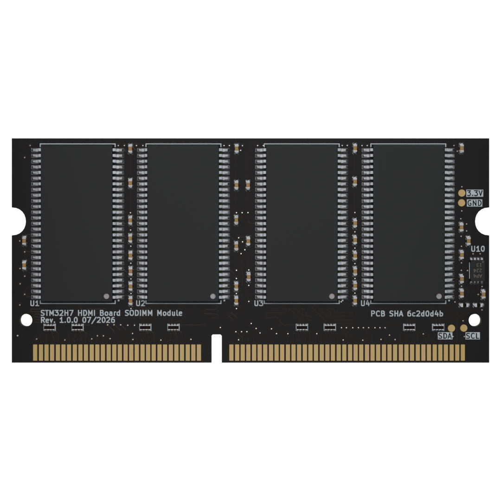

# STM32H7 HDMI Board SODIMM Module

Copyright (c) 2026 [Antmicro](https://www.antmicro.com)

## Overview

This project contains open hardware design files for a SDRAM SODIMM Module designed for [STM32H7 HDMI Board](https://openhardware.antmicro.com/boards/stm32h7-hdmi-board/?tab=features). The module provides 512 MB of memory with 32-bit data bus compatible with the STM32H747 SDRAM memory controller. The module follows the JEDEC 144-pin SO-DIMM pin assignment with only DQ[0:31] implemented. Board also features an EEPROM for Serial Presence Detect.

The design files were prepared in KiCad 10.x.

## Key features

* 144 Pin SO-DIMM PCB edge connector
* JEDEC 144-pin SO-DIMM pin-assignment with only DQ[0:31] implemented
* 512 MB of memory
* 2Rx8 (32 data bus) memory organization
* 8 x ISSI IS42S86400F-7TL SDRAM devices with maximum clock frequency of 200MHz
* Compatible with STM32H747 FMC

## Licensing

This project is published under the [Apache-2.0](LICENSE) license.
