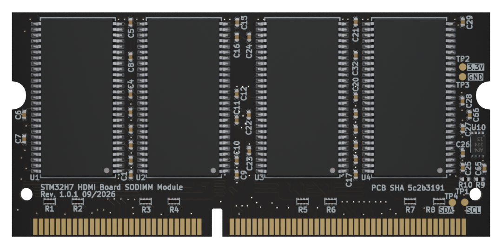

# STM32H7 HDMI Board SODIMM Module

Copyright (c) 2026 [Antmicro](https://www.antmicro.com)

## Overview

Antmicro’s STM32H7 HDMI Board SODIMM Module is an SDRAM memory module designed to work with STM32H7 HDMI Board. The board provides 512 MB of SDRAM memory supporting a maximum memory clock frequency of 200 MHz. The module exposes 32-bit data bus for being fully compatible with the STM32H747 FMC (Flexible Memory Controller) used in STM32H7 HDMI Board. SODIMM Module follows the JEDEC 144-pin SODIMM pin assignment with only half of the data bus implemented (32 bits). The board dimensions comply with the MO-190-C SODIMM Mechanical Specifications. It also features an EEPROM memory chip for Serial Presence Detect.

The design files were prepared in KiCad 10.x.

## Key features

* 512 MB of SDRAM memory
* 144 Pin SODIMM PCB edge connector
* 2Rx8 (32 data bus) memory organization
* 8 x ISSI IS42S86400F-7TL SDRAM devices with maximum clock frequency of 200MHz
* JEDEC 144-pin SODIMM pin-assignment with only half of the data bus implemented (DQ[0..31])
* Dimensions comply with the MO-190-C SODIMM Mechanical Specifications
* Fully compatible with STM32H747 FMC

## Project structure

The main directory contains KiCad PCB project files, a LICENSE and a README.
The remaining files are stored in the following directories: 

* `img` - contains graphics for this README

## Licensing

This project is published under the [Apache-2.0](LICENSE) license.
